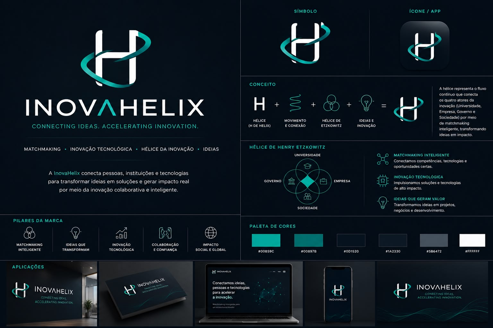

# Plano de Update - InovaHelix

Data de atualizacao: 2026-05-04

## Objetivo

Migrar de CRA + JS + CSS Modules para Vite + React 19 + TypeScript + Tailwind v4,
embutindo inteligencia de produto desde o inicio (score + explicacao de match).

## Status Geral

- Fase A: Concluída
- Fase B: Concluída
- Fase C: Concluída
- Fase D: Concluída
- Rebranding & Sweep InovaHelix: Concluído e Validado

## Progresso por Fase

### Fase A - Fundacao (Concluida)

- [x] Setup Vite + React 19 + TypeScript.
- [x] Setup Tailwind CSS v4 com `@tailwindcss/postcss`.
- [x] Correcoes de pipeline v4 (`@reference`, `@theme`, utilitarios custom).
- [x] Dark mode com classe no `html` e persistencia no localStorage.
- [x] Tipos globais em `src/types/index.ts`.
- [x] Algoritmo de matchmaking em `src/lib/matching.ts`.
- [x] Validacoes em `src/lib/validation.ts`.
- [x] Build estavel (`npm run build` passando).

### Fase B - Componentes Base (Em andamento)

- [x] Navbar migrada para TS + Tailwind (`src/components/Navbar.tsx`).
- [x] Footer migrado para TS + Tailwind (`src/components/Footer.tsx`).
- [x] ErrorBoundary migrado para TS (`src/components/ErrorBoundary.tsx`).
- [x] Design system inicial criado:
  - `src/components/ui/Button.tsx`
  - `src/components/ui/Input.tsx`
  - `src/components/ui/Card.tsx`
  - `src/components/ui/Badge.tsx`
  - `src/components/ui/Stepper.tsx`
- [x] TaskDetail migrado para TS + Tailwind (`src/components/TaskDetail.tsx`).

### Fase C - Fluxo Inteligente (Iniciada)

- [x] Router real implementado com layout compartilhado (Navbar + Outlet + Footer).
- [x] Rotas criadas em `src/App.tsx`:
  - `/`
  - `/explore`
  - `/about`
  - `/login`
  - `/register`
  - `/onboarding/profile`
  - `/onboarding/new-project`
  - `/app/dashboard`
- [x] Home comercial conectada em `src/pages/Home/Home.jsx`.
- [x] Reorganizacao de paginas do app (pos-login) em `src/pages/MainApp/*`.
- [x] Seletor de perfil em `src/pages/MainApp/Onboarding/ProfileSelectorPage.tsx`.
- [x] Wizard inicial com React Hook Form + Zod em `src/pages/MainApp/Onboarding/ProjectWizardPage.tsx`.
- [x] Dashboard principal em `src/pages/MainApp/Dashboard/DashboardPage.tsx`.

### Firebase - Modelo da V2 (Iniciado)

- [x] Estrutura de collections centralizada em `src/firebase/models/schema.ts`.
- [x] Tipagem de documentos (`users`, `projects`, `matches`, `interests`, `onboarding_drafts`).
- [x] Plano inicial de indexes para consultas de match e projetos.
- [x] Criar regras Firestore alinhadas ao novo modelo.
- [x] Implementar servicos de leitura/escrita para o wizard e dashboard.

### Fase D - Match Engine no fluxo final (Concluída)

- [x] Persistir onboarding no Firebase.
- [x] Ligar wizard ao schema completo de projeto em producao.
- [x] Exibir matches reais por usuario logado.
- [x] Implementar acao "Tenho interesse".

## Backlog Imediato

1. Integrar contexto de autenticacao real no roteamento e na Navbar (Concluído).
2. Substituir paginas placeholder de login/register por versoes finais (Concluído).
3. Evoluir wizard para passos guiados completos (Concluído).
4. Conectar submit do wizard com persistencia Firebase (Concluído).
5. Criar pagina de matches consumindo dados reais do usuario (Concluído).
6. Criar regras e indexes no Firebase a partir de `src/firebase/models/schema.ts` (Concluído).

## Riscos e Observacoes

- Tailwind v4 exige cuidado com `@apply` em utilitarios customizados.
- Em v4, tokens de cor custom precisam estar no `@theme` do CSS de entrada.
- O fluxo de transição está blindado no contrato e no roteamento do app.

## Criterio para fechar Fase C

- Fluxo onboarding completo (perfil -> wizard -> salvamento) (Concluído).
- Dashboard consumindo projeto salvo (Concluído).
- Navegacao protegida por autenticacao real (Concluído).
